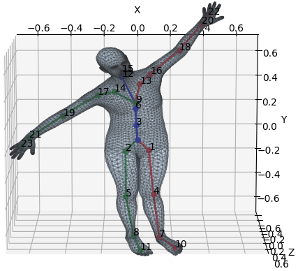

SMPL layer for PyTorch
=======

[SMPL](http://smpl.is.tue.mpg.de) human body [\[1\]](#references) layer for [PyTorch](https://pytorch.org/) (tested with v0.4 and v1.x)
is a differentiable PyTorch layer that deterministically maps from pose and shape parameters to human body joints and vertices.
It can be integrated into any architecture as a differentiable layer to predict body meshes.
The code is adapted from the [manopth](https://github.com/hassony2/manopth) repository by [Yana Hasson](https://github.com/hassony2).

<p align="center">

</p>

## Installation

You can install smpl-pytorch from [PyPI](https://pypi.org/project/smpl-pytorch/):

    pip install smpl-pytorch

Additionally, you have to download the SMPL pickle files:
  * Download the models from the [SMPL website](http://smpl.is.tue.mpg.de/) by choosing "SMPL for Python users". Note that you need to comply with the [SMPL model license](http://smpl.is.tue.mpg.de/license_model).
  * Extract and copy the `models` folder into the `smpl/native/` folder.

Alternatively, you can set up the package manually (see next).


## Setting up

* Dependencies:
  * Install the dependencies listed in [environment.yml](environment.yml)
    * In an existing conda environment, `conda env update -f environment.yml`
    * In a new environment, `conda env create -f environment.yml`, will create a conda environment named `smplpytorch`
* Download SMPL pickle files:
  * Download the models from the [SMPL website](http://smpl.is.tue.mpg.de/) by choosing "SMPL for Python users". Note that you need to comply with the [SMPL model license](http://smpl.is.tue.mpg.de/license_model).
  * Extract and copy the `models` folder into the `smpl/native/` folder.

## Demo

Forward pass the randomly created pose and shape parameters from the SMPL layer and display the human body mesh and joints:

`python demo.py`

## Acknowledgements
The code **largely** builds on the [manopth](https://github.com/hassony2/manopth) repository from [Yana Hasson](https://github.com/hassony2), which implements the [MANO](http://mano.is.tue.mpg.de) hand model [\[2\]](#references) layer.

The code is a PyTorch port of the original [SMPL](http://smpl.is.tue.mpg.de) model from [chumpy](https://github.com/mattloper/chumpy). It builds on the work of [Loper](https://github.com/mattloper) et al. [\[1\]](#references).

The code [reuses](https://github.com/gulvarol/smpl/pytorch/rodrigues_layer.py) [part of the code](https://github.com/MandyMo/pytorch_HMR/blob/master/src/util.py) by [Zhang Xiong](https://github.com/MandyMo) to compute the rotation utilities.

If you find this code useful for your research, please cite the original [SMPL](http://smpl.is.tue.mpg.de) publication:

```
@article{SMPL:2015,
    author = {Loper, Matthew and Mahmood, Naureen and Romero, Javier and Pons-Moll, Gerard and Black, Michael J.},
    title = {{SMPL}: A Skinned Multi-Person Linear Model},
    journal = {ACM Trans. Graphics (Proc. SIGGRAPH Asia)},
    number = {6},
    pages = {248:1--248:16},
    volume = {34},
    year = {2015}
}
```

## References

\[1\] Matthew Loper, Naureen Mahmood, Javier Romero, Gerard Pons-Moll, and Michael J. Black, "SMPL: A Skinned Multi-Person Linear Model," SIGGRAPH Asia, 2015.

\[2\] Javier Romero, Dimitrios Tzionas, and Michael J. Black, "Embodied Hands: Modeling and Capturing Hands and Bodies Together," SIGGRAPH Asia, 2017.
